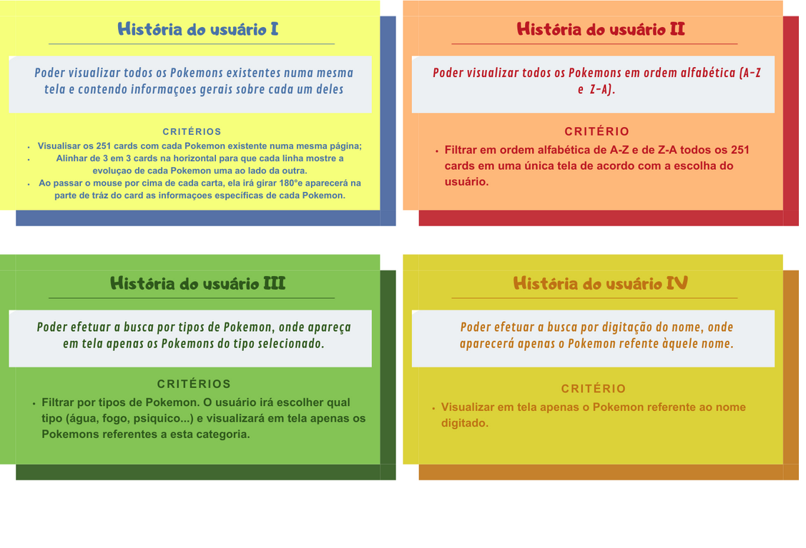
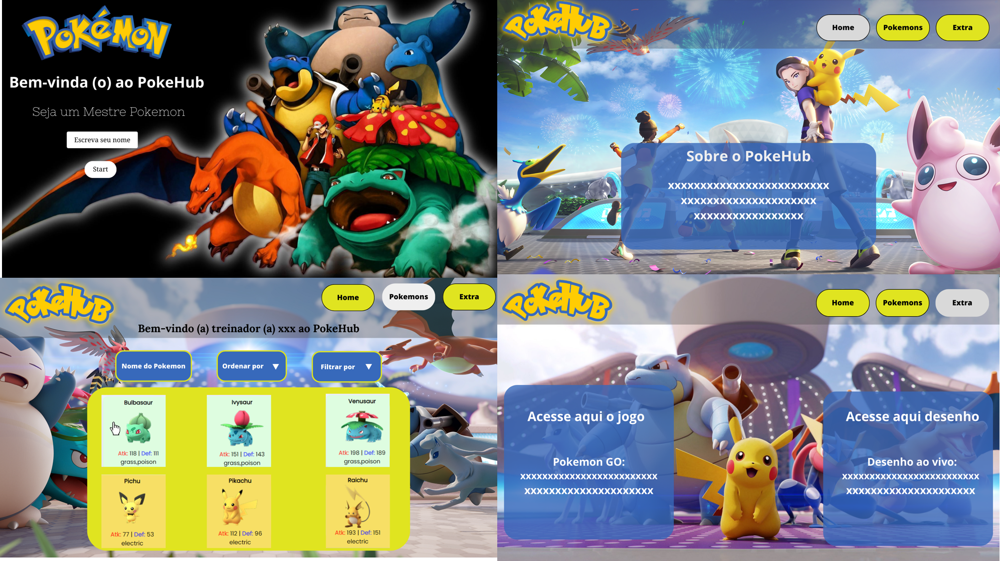

# Data Lovers

## Índice

* [1. Resumo do Projeto](#1-Resumo-do-Projeto)
* [2. Funcionalidade](#2-Funcionalidade)
* [3. Definição de produto](#3-Definição-de-produto)
* [4. Histórias de usuário](#4-Histórias-de-usuários)
* [5. Interface Web e Mobile](#5-Interface-Web-e-Mobile)
* [6. Testes de usabilidade](#6-Testes-de-usabilidade)
* [7. Tecnologias utilizadas](#7-Tecnologias-utilizadas)
* [8. Desenvolvedoras ](#8-Desenvolvedoras )

***

## 1. Resumo do Projeto

Este projeto foi elaborado como parte do bootcamp da Laboratoria.

O objetivo deste projeto proporcionar o auto aprendizado, seguido de aplicações de competências técnicas, abordando HTML, CSS e JavaScript, bem como aprimorar a compreensão do universo do desenvolvimento web.

 

## 2. Funcionalidade

Neste projeto você encontrará  página web para visualizar um conjunto (set) de dados que se adeque às necessidades do usuário.

* Visualização de Pokémons em cards: Os usuários podem ver os Pokémons em cards intuitivos e atraentes, exibindo informações importantes, como nome e tipo.

* Classificação de Pokémons: Os usuários têm a capacidade de classificar os Pokémons de acordo com suas preferências, como por tipo, nome e ordenação de A-Z n. Detalhes do Pokémon: Ao clicar em um card de Pokémon, os usuários podem obter informações detalhadas sobre aquele Pokémon específico, incluindo raridade e resistência.

## 3. Definição de produto

O PokeHub foi criado para que os usuários possam interagir com os cartões que exibem dados sobre os 251 pokémons. Além disso, acessar rapidamente o site do jogo Pokemon Go oficial e também assistir o desenho com todas as temporadas disponíveis, de um jeito fácil e prático.  

  ## 4. Histórias de usuário 🙋‍♀️🙋‍♀️
  O projeto foi construido para fãs de Pokémon, tanto de jogos como do desenho, que quer ter mais informações sobre os personagens.

  Ao entrar no site, o usuário visualizará uma página inicial com um botão **start**, em seguida, será direcionado a página **home** onde encontrará uma breve explicação do site. Na página Home, o usuário encontrará um menu com 3 opções de navegação, sendo: **Home, Pokemons e Extra**. Na página Pokemons, o usuáriko encontrará todos os Pokemóns, e ao passar o mouse por cima do card com a imagem, terá as informações de: raridade e resistência. Há também uma opção para ordenar os Pokemóns por ordem Alfabética, um campo para a busca especifica pelo nome e um filtro para que seja possível filtrar o tipo do personagem. Na página extra, o usuario encontrará links que que o redirecionará para o jogo oficial **Pokemon Go** e o desenho com todas as temporadas.

O site foi pensando para ser utilizado quando fãs do desenho quiserem ter mais informações do personagem, ou, quando jogadores de Pokémon quiserem saber as características dos personagens para escolher de acordo com seu objetivo no jogo (atacar, defender, dar assistência);

  

  ## 5. Interface Web e Mobile

 ### Protótipo de alta fidelidade feito no MarvelApp
  [Visite o Protótipo]( https://marvelapp.com/prototype/19ij1bf9/screen/92444608)
 
  

  Na imagem abaixo o protótipo mostra como seria a página com as opções dos cards com a implementação do filtro de ordenação de A-Z e Z-A.

   

### Projeto Final

  ## 6.  Testes de usabilidade
  

  ## 7.  Tecnologias utilizadas
  
  
  

  ## 8. Desenvolvedoras 

 #### Rafaela Guedes      |     | Tamara Araujo 

   

